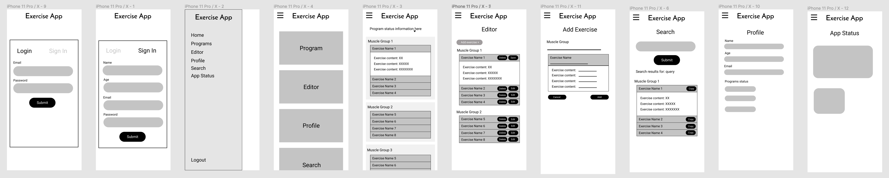
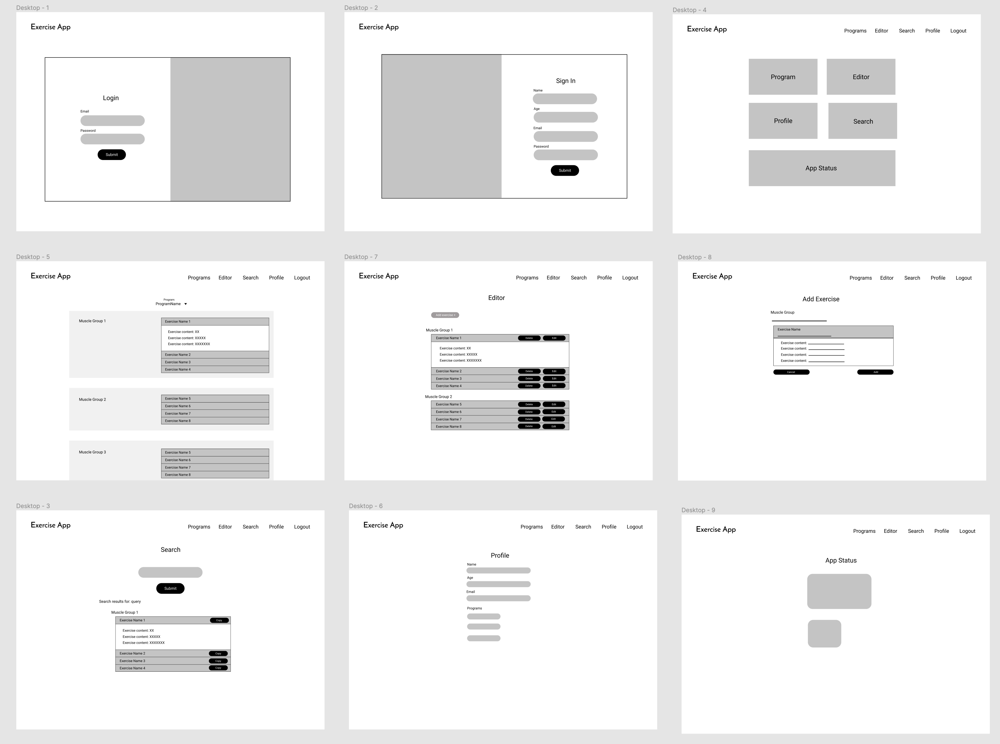
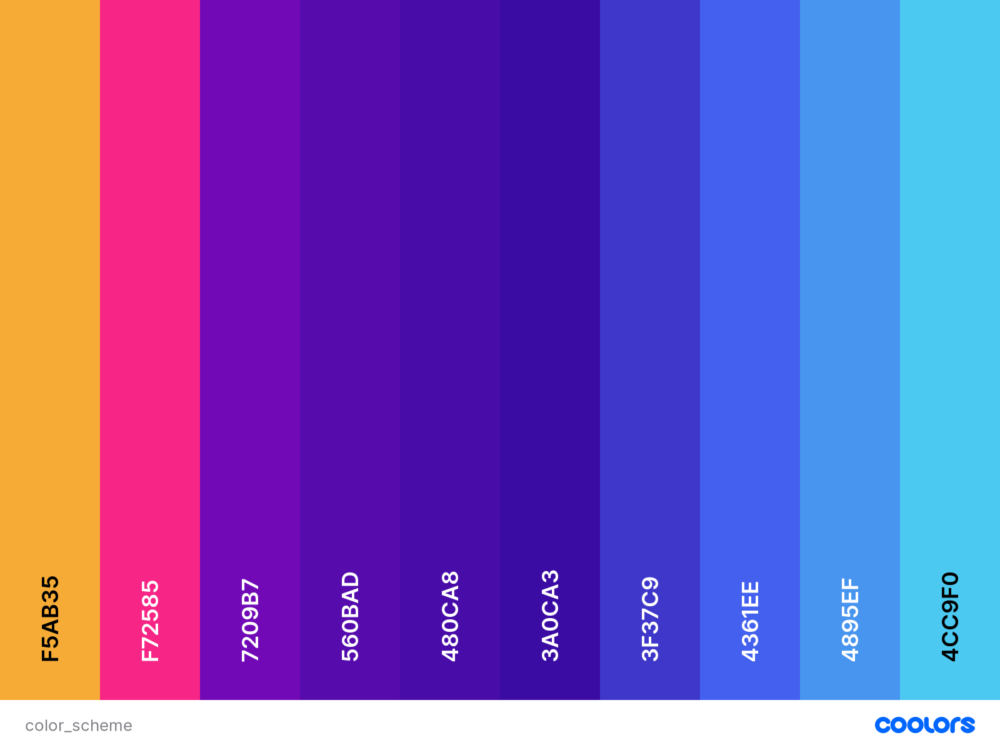

# **Fitness Exercise Development**

## **Backend Development Project - Code Institute**

&nbsp;

The Fitness Exercise Development (FED) is website created to save your exercise program info. The idea is that it works as an application that you can access as an website, and the primarly focus is to the mobile view (as it will be mainly accessed during a gym session)

This project is part one of the four milestone project of Code Institute Full Stack Developer course, and aims to show an interactive website using HTML5, CCS3 and Javascript, using Python and Flask to manage the application backend and MondoDB to store its information.

Access the website here: [Fitness Exercise Development*](http://fitness-exercise-development.herokuapp.com/)

&nbsp;

## **Table Of Contents**

* [User Experience](#user-experience-(ux))
* [Design Process](#design-process)
* [Features](#features)
* [Technologies Used](#technologies-used)
* [Testing](#testing)
* [Deployment](#deployment)
* [Credits](#credits)
* [Acknowledgments](#acknowledgments)

&nbsp;

## **User Experience (UX)**

### **Project Goals:**

* Display the exercise program in a single page
* Create, read, edit and delete exercises through the application website
* Show User status info
* Show App status info to Admin
* Search exercises and be able to add them to your program

### **User Stories**

#### **New Users:**

* I go to the gym regurlary and looking for a way to save my exercise program info, and be able to update it at the gym.
* I'm a PT and want looking for an application to suggest to my client so he can have the exercises info when I'm not with him.
* I'm a gym owner looking for an App where my clients can find exercises suggestions

#### **Returning User:**

* I sign up for this application and using regularly. Now I want to change my exercise programa, and looking for exercises suggestions
* I want to update my exercises program info and know its duration

#### **Business Owner:**

* I want to gather exercises information to analyse the gathered information and in the future provided tailored exercises programs
* I want to have an application status page to I can understand how many users we have a summary of the saved data.

## **Design Process**

### **Strategy Plane:**

The main objective of this website is to make easier for people to access, add and edit their exercise program wherever they are. For that the application is designed mainly focused on mobile users, letting straight forward where to find information and how to edit it. The main page accessed will be the Program page wher the user can see their exercise list, as well as estimated duration to finish it.

### **Scope Plane:**

The key features that this project aims to attend are:

* Having a Program page easily accessible though a smartphone where the only the necessary info is displayed
* Provide a tool to edit the exercise program, leeting the user to add, edit or delete an exercises
* Show the user status in the application for reference
* Promote exercises saved in the application by other users trough the Search page for inspiration and let the user able to copy it to their own program.

### **Skeleton Plane:**

The wirefram of this project aimed to create simple but effective pages, where the information can be seen and collected easlily, and only necessary elements are displayed. For that it was decided that the website wouldn't much have images, so it can load fast as well.

The layout of the wireframes where designed using Figma, as an starting point of how to display the project goal in a simple and direct format, in any kind of device.

To improve page load speed, it was decided to not add external Font styles in this project. The visual style was developed taking in cosideratin the elements and styles available on the Materialize CSS Framework, that will be used to develope the website.

### **Wireframes**:

The project wireframes can be accesed [clicking here](https://www.figma.com/file/n45E2cE93O04XF5NEsHYW7/Untitled?node-id=0%3A1).

Mobile:

Tablet / Desktop:

### **Surface Plane:**

As the project aims to simple and fast, it was decided use some componets largely used in the Front End webdesing nowadays to improve its visuals, such as: Aurora effects with gradient colors, Glassmorfism and Collapsibles accordions.

The color scheme aims to have a vibrant feeling that stands out and hype the user for his exercise session, while keeping a modern and not distractive visual.

The icons used  in the website are from [Font Awesome](https://fontawesome.com/) and were used in the project logo and as visual reference for the each page.

All pages can be easily accesed though the cards in the Home page or through the application navagiation menu, which in the mobile view is diplayed through a hambuger icon and side menu for the best usage of space.

In the Program page and Editor it was used collapsibles accordions to don't polute the page information, and display only the information the user really wants to see. The Search page is provided for user find exercises inspirations and a button to easily copy th card information to your own Program. Lastely, the profile page show the user info registered as well as their info status.

The Admin user have access to the App Status page, where he can verify some information from this application project, which can be used for future project upgrades.

## **Features**

Thouugh the Header Navigation menu that is commom to all pagesm the user can access all project features that are displayed on diferent pages.

### **Consistent features across all pages:**

* Header section with a responsive menu and logo. The menu can be accessed only by users that logged in the application.
* Footer section with project information and social logo.

### **Home:**

* Four cards where the user can access any of the applications features (Program list, Program Editor, User profile and Search functionality).
* The Admin user can see a fifth card to access the App Status page.

### **Index:**

* Index page shows a responsive and animated card where user can select either to register in the application, or to log in. 

### **Programa:**

* On this page user can see all their execerices registred in the application, separeted by muscle group. The exercises cards are presend in a collapsible accordion. At the top is displayed an estimated time to complete the whole program.

### **Editor:**

* On the Editor page the user can add a new exercise to their program thorugh a buttton that links to the Add Exercise page. It is also presented their current exerceises card similarly to the Program page, but with two extra buttons to Edit or Delete an exercise.

### **Add Exercise:**

* This page displays a form where the user can add a new exercise to their program. The form is presented with the same card layout from the Program page, so the user can have a better undertand on how the information will be displayed after saved. There is a button to Cancel the creation a new exercise and a button to Save it.

### **Edit Exercise:**

* This page displays the same form and feature of the Add Exercise page, but with the exercise information registred previously by the user that he wants to change.

### **Profile:**

* This page show the user information added through the Register form
* It is also displayed some application status from the specifc used logged.

### **Search:**

* The Search page shows a search box input and a brief exaplanation how the user can use this this page.
* Upon searching a word, the page shows the search result with the same layout used on the Program page, where the cards displayed contatin the search query word. To test it, you can seach for "Shoulder" or "Legs"

### **App Status:**

* On this page the Admin can see some applications stauts information, such as: quantity of user registred, quantity of exercises registred, etc.

###CONTINUAR daqui

### **Features I could implement in the future:**

* Let possible to be searched any location, not only a city and not only in the Unite States.
* Display more breweries information, speciall the beers produced and some individual visual representation (like a logo or product image)

## **Technologies Used**

### **Languages, libraries, frameworks, editors and version control**

* HTML5 - To create and add content to the website.
* CSS3 - To style the website content and provide responsiveness. 
* JavaScript - Used get the terms searched and through the APIs utilized in this project find the brewries information and display it to the user. 
* [Bootstrap](https://getbootstrap.com/) - This framework was used on the website Header and Navigation menu.
* [VS Code](https://code.visualstudio.com/) - The development tool used to write the website code
* [GitHub](https://github.com/) - Used for version control, host files and deploy website.

### APIs**

* [Google Maps Platform](https://developers.google.com/maps/documentation) - Used to display the map and the breweries locations.
* [Open Brewery DB](https://www.openbrewerydb.org/) - Used to get all breweries informations necessary for this project.
* [EmailJS](https://www.emailjs.com/) - Used to get the information send on the website contact form and send it to the website manager.

### **Other Tools Used**

* [Figma](https://figma.com/) - To create website wireframes.
* [Delesign](delesign.com) - Images
* [Google Fonts](https://fonts.google.com/) - Primary website font
* [Logo Maker](https://logomakr.com/)- Used to create the website logo
* [Font Awesome](https://fontawesome.com/) - Icons on Events and Riders page. 

### **Educational Resources**

* [CSS Tricks](http://css-tricks.com/) -  Mainly used as a resource to help with Flexbox positioning
* [Stack Overflow](https://stackoverflow.com/) - Used to find the reason of some errors found during the website development.

//Continuar daqui

## **Testing**

### **Testing User Stories:**

*   New user: 
    *   Looking for a new bicycle on the internet, I found Push & Pedal website. I could find their products easily, since the first banner and link directs me to their product page. 
*   Returning user: 
    *   I bought a Push & Pedal bicycle and have some questions about the necessary maintenance. I’m commuting to my work, and had only my smartphone to access their website, and the contact information and form was very easy to find and access.
*   Business owner: 
    * I’m pleased with the consistency of the design on different devices. Having a banner inviting to join our event helped the promotion and to increase the number of participants.

### **Validating The Code:**

*   All HTML files validated with [W3C Markup Validation Service](https://validator.w3.org/)  - No Errors Found
*   CSS file validated with [W3C CSS Validation Service](https://jigsaw.w3.org/css-validator/) - No Errors Found

### **Browsers testing**

Website tested on the following browsers manually, no error found

*   Chrome
*   Safari
*   Mozilla Firefox
*   Microsoft Edge

### **Responsiveness testing**

Website tested on the following devices manually or using Chrome Developer Tools, no error found

*   Iphone X
*   Ipad Pro
*   Google Pixel
*   Macbook Pro 16”
*   Desktop Monitor Philips 25”

## **Deployment**

The code of this project was written using [Gitpod](https://www.gitpod.io/) and deployed and hosted on [GitHub Pages](https://pages.github.com/), following the below steps:

1.   Opened [GitHub](https://github.com/) page and signed in
2.   Accessed the repository [user-centric-FED-project](https://github.com/pcantarelli/user-centric-FED-project)
3.   Go to **Settings**
4.   On the GitHub Pages sections selected on the dropdown menu **'Master Branch' > '/root'**
5.   Clicked on **Save**
6.  Website is live now [here GitHub Pages](https://pcantarelli.github.io/user-centric-FED-project/)

#### **Deploy your version of this project**

1.   Be sure to have GIT instaççed
2.  Clone [this repository](https://github.com/pcantarelli/user-centric-FED-project)
3. Follow the steps above to deploy your project on GitHub Pages

## **Credits**

### **Content**

This website was developed using the Code Institute project templated that can be found on [this repository](https://github.com/Code-Institute-Org/gitpod-full-template).

The Read.me file was based on Code Institute [readme-template](https://github.com/Code-Institute-Solutions/readme-template) and the [README.md](https://github.com/jacksheehy15/milestone-project-1) file created by my fellow colleague Jack Sheehy. Thank you so much for the inspiration.

The base code from the sections: [Header navbar](https://getbootstrap.com/docs/4.5/components/navbar/), [Hero slide](https://getbootstrap.com/docs/4.5/components/carousel/) and [Contact form](https://getbootstrap.com/docs/4.5/components/forms/) were based on the linked documentation from Bootstrap.

### **Media**

All images were taken online on [Unsplash](https://unsplash.com/), [Burst](https://burst.shopify.com/) and [Pure Cycles](https://www.purecycles.com/#) website. Really appreciated that support.

### **Acknowledgments**

I’d like to thank the Code Institute tutors and support staff. Their support definitely helped me to achieve all my goals on this project. 

Thanks to Mark Railton, my mentor, that also supported me during this project. 
